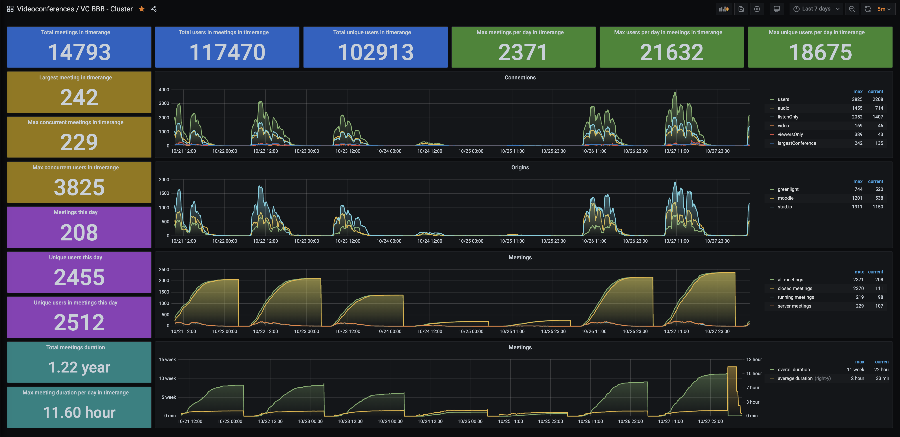
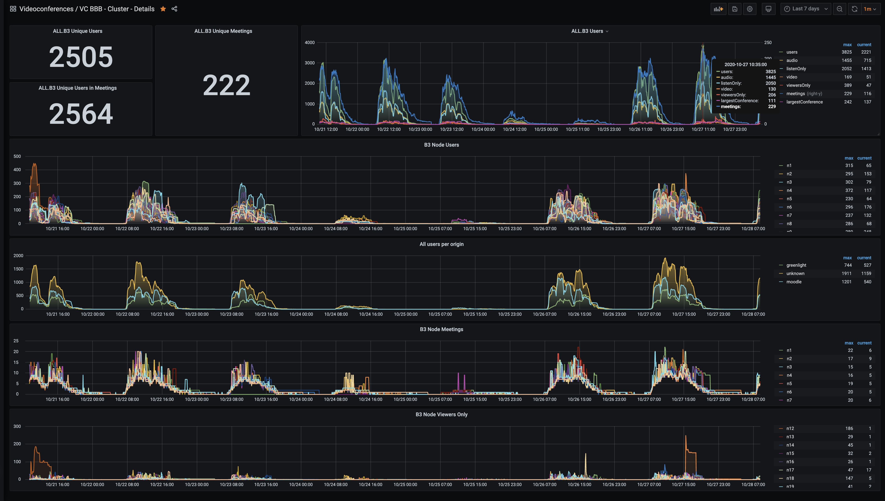
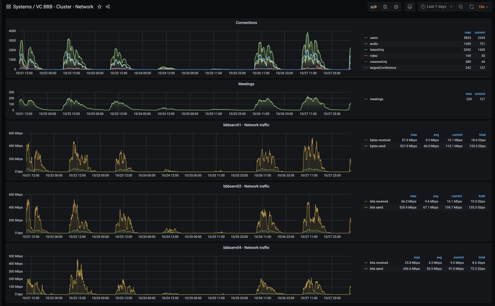

# Grafana Dashboards

## BBB Cluster Overview

Displays summarized cluster data for a specific period of time.

## BBB Cluster Details

Shows detailed data of each cluster node.

## BBB Cluster Network

If you like to get the network load for each bbb-host, this Grafana dashboard needs a secondary InfluxDB that get its data by a telegraf daemon on each host.
